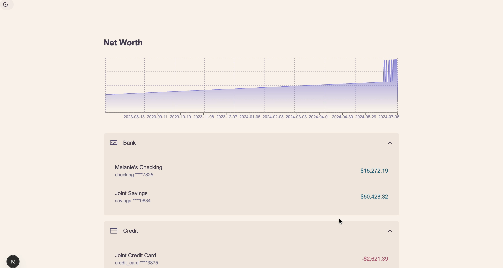

# Net Worth Display

A modern, responsive web application for tracking and visualizing your net worth across different account types. Built with Next.js, TypeScript, and Tailwind CSS.

## Features

- 📊 Interactive net worth chart showing historical balance trends
- 💰 Account grouping by type (depository, credit, investment, etc.)
- 🌓 Dark/Light theme support
- 📱 Responsive design for all devices
- 🔒 Secure account information display (masked account numbers)
- ⚡ Fast and efficient data aggregation
- 🎨 Beautiful UI with custom color scheme

## Tech Stack

- **Framework**: Next.js 14 with App Router
- **Language**: TypeScript
- **Styling**: Tailwind CSS
- **Charts**: Recharts
- **Icons**: Lucide Icons
- **State Management**: React Hooks
- **Theme**: Custom theme system with dark/light mode

## Getting Started

### Prerequisites

- Node.js 18.x or later
- npm or yarn

### Installation

1. Clone the repository:
```bash
git clone https://github.com/yourusername/net-worth-display.git
cd net-worth-display
```

2. Install dependencies:
```bash
npm install
# or
yarn install
```

3. Run the development server:
```bash
npm run dev
# or
yarn dev
```

4. Open [http://localhost:3000](http://localhost:3000) in your browser.

## Project Structure

```
src/
├── app/                    # Next.js app directory
│   ├── api/               # API routes
│   └── page.tsx           # Main page component
├── components/            # React components
│   ├── accordion/        # Accordion component
│   ├── navbar/           # Navigation bar
│   ├── footer/           # Footer component
│   └── product/          # Product-specific components
├── types/                # TypeScript type definitions
├── utils/                # Utility functions
└── api/                  # API integration
```

## Features in Detail

### Account Management
- Groups accounts by type (depository, credit, investment, etc.)
- Displays current balance for each account
- Shows masked account numbers for security
- Expandable/collapsible account groups

### Net Worth Tracking
- Historical balance tracking
- Interactive chart visualization
- Date-based balance aggregation
- Total net worth calculation

### Theme System
- Light/Dark mode support
- Custom color scheme
- Smooth theme transitions
- Persistent theme preference

## Development

### Available Scripts

- `npm run dev` - Start development server
- `npm run build` - Build for production
- `npm run start` - Start production server
- `npm run lint` - Run ESLint
- `npm run format` - Format code with Prettier

### Code Style

- TypeScript for type safety
- ESLint for code linting
- Prettier for code formatting
- Tailwind CSS for styling

## Contributing

1. Fork the repository
2. Create your feature branch (`git checkout -b feature/AmazingFeature`)
3. Commit your changes (`git commit -m 'Add some AmazingFeature'`)
4. Push to the branch (`git push origin feature/AmazingFeature`)
5. Open a Pull Request

## License

This project is licensed under the MIT License - see the [LICENSE](LICENSE) file for details.

## Acknowledgments

- [Next.js](https://nextjs.org/)
- [Tailwind CSS](https://tailwindcss.com/)
- [Recharts](https://recharts.org/)
- [Lucide Icons](https://lucide.dev/)

## A Note to the Evaluators



To respect the 4-hour time constraint, I've reused several components and styles from previous projects.

The chart comes from [ShadCN's UI library](https://ui.shadcn.com/charts).

I ran into CORS errors while fetching data, so I used test data (from `test-data.ts`) that I return in `api.ts`.

I'm using TypeScript to ensure strong typing, but due to time constraints, I had to use `any` in a few places within the project.

For the display, I've grouped data by account type and used an accordion for this layout.

### Regarding the components:

- I aimed to follow Atomic Design principles and organized components into related folders accordingly.
- I use Tailwind CSS (v4) for styling, with design tokens defined in `globals.css` (see [Tailwind Docs](https://tailwindcss.com/docs/theme)).
- I've implemented a theme switcher using `dark:` mode and React Context for state management.

### If I had more time, I would:

- Create stronger interfaces and types.
- Add filters for account types and subtypes.
- Ensure performance testing, accessibility, unit tests, and security.
- Add internationalization (i18n) support.
- Add time scale options to the net worth chart.
