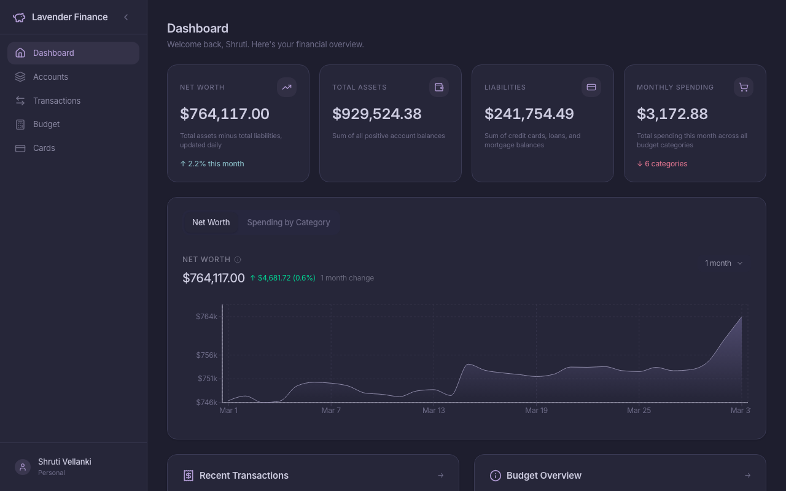
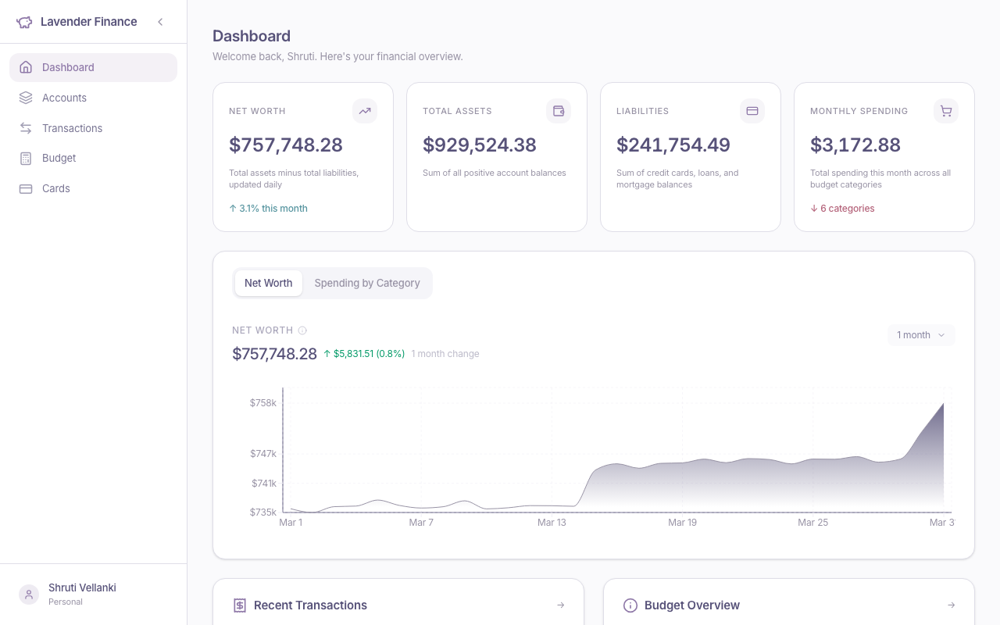
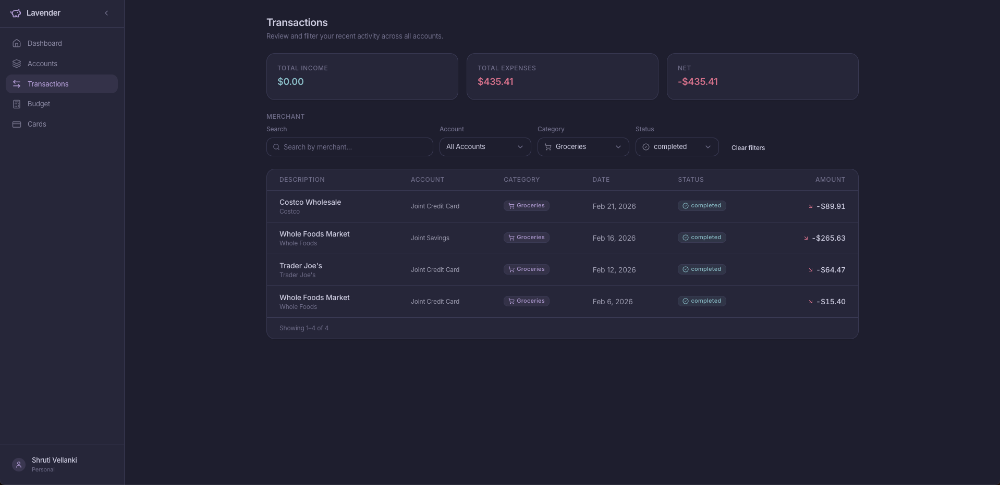
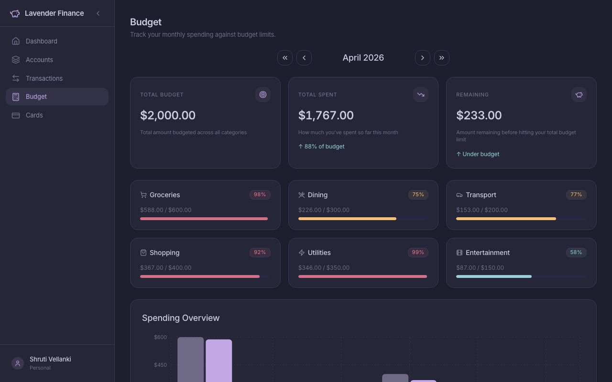
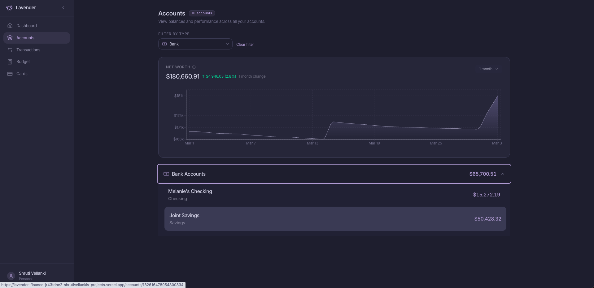
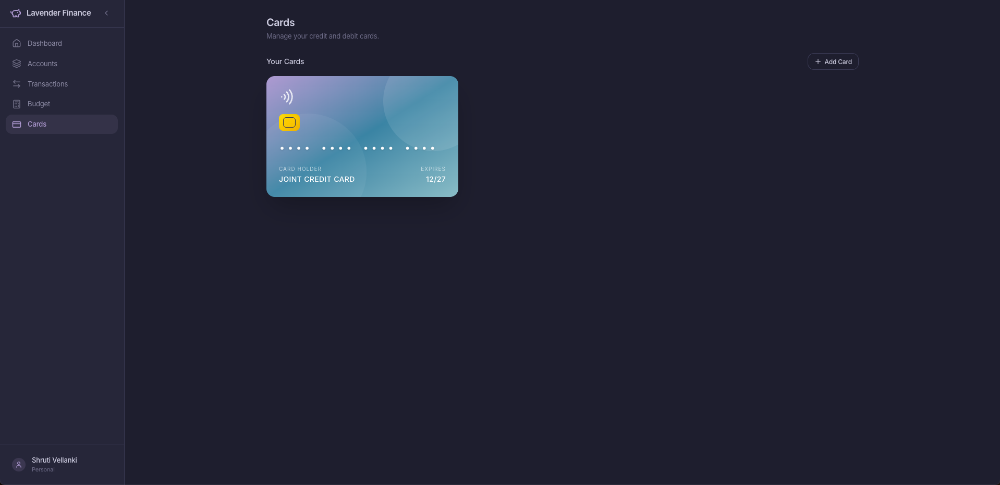
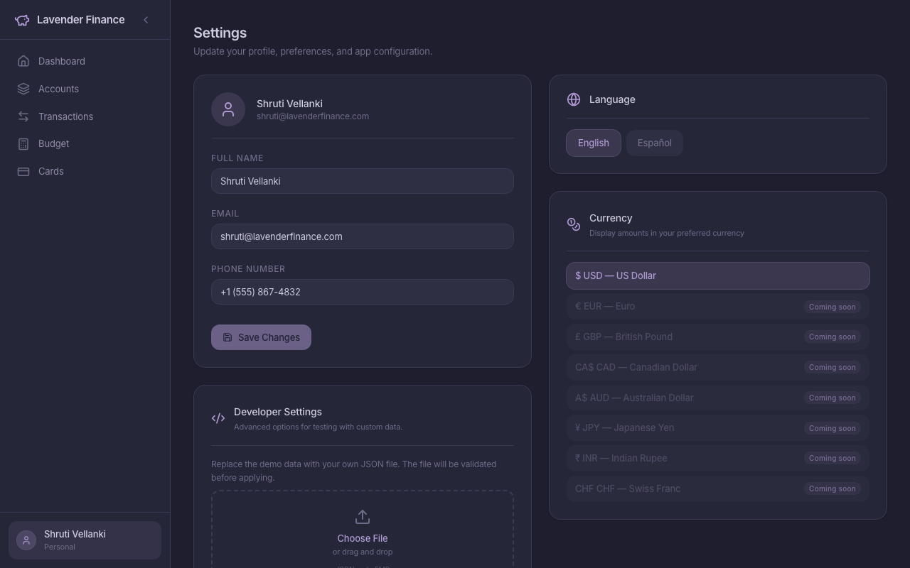
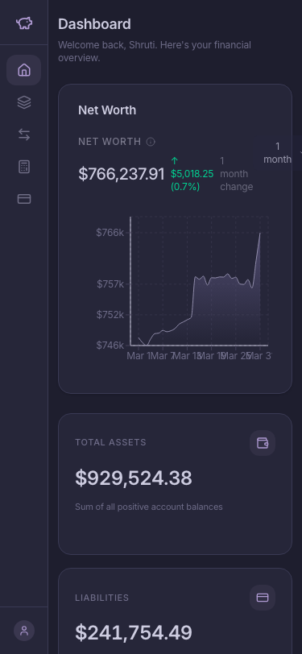

# 🐷💰 Lavender Finance

A personal finance dashboard built with React + TypeScript. Track accounts, transactions, budgets, and cards across a responsive UI with lavender-themed light and dark modes.

<p>
  
</p>

## Tech Stack

- **React 19** with TypeScript
- **Vite** for bundling and dev server
- **Tailwind CSS v4** for utility-first styling
- **Recharts** for interactive charts
- **React Router** for client-side routing
- **react-i18next** for internationalization (English / Spanish)
- **Lucide React** for icons

## Features

### Dashboard

Net worth chart, spending breakdown, KPI stat cards, and quick-links to transactions and budget.

<p>
  
</p>

### Transactions

Searchable, filterable table (merchant, account, category, status) with mobile card layout, pagination, and detail modal.

<p>
  
</p>

### Budget

Monthly spending overview with bar charts, navigable month selector, stat cards for total budget / spent / remaining.

<p>
  
</p>

### Accounts

Grouped by type (depository, credit, investment, loan) with accordion layout, filterable net worth chart, and per-account detail view with balance history.

<p>
  
</p>

### Cards

Multi-step add-card flow (identity verification, PIN, card details), card detail view with delete, optimistic updates.

<p>
  
</p>

### Settings

User profile, language selector, currency display, and developer settings with JSON import/export.

<p>
  
</p>

### Responsive

Collapsed icon sidebar with tooltips on mobile, card-based layouts on small screens.

<p>
  
</p>

### More

- **Theming** — Lavender Dawn (light) and Lavender Moon (dark) with toggle in sidebar popover; dark mode is default
- **i18n** — full English and Spanish translations

## Getting Started

### Prerequisites

- Node.js 18+
- npm

### Install and Run

```bash
npm install
npm run dev
```

The app starts at `http://localhost:3000`.

### Build for Production

```bash
npm run build
npm run preview
```

### Lint

```bash
npm run lint
```

## Project Structure

```
src/
├── app/                    # App shell, routing, layout, providers
│   ├── layout/             # Sidebar, main layout wrapper
│   └── providers.tsx       # Theme, currency, router providers
├── features/               # Feature modules (pages + feature-specific components)
│   ├── dashboard/
│   ├── accounts/
│   ├── transactions/
│   ├── budget/
│   ├── cards/
│   └── settings/
├── shared/
│   ├── components/         # Reusable UI components (mirrors lavender-storybook)
│   ├── constants/          # Category icons, shared mappings
│   ├── context/            # CurrencyProvider
│   ├── hooks/              # useIsMobile, etc.
│   └── utils/              # cn(), aggregation helpers
├── services/               # Mock API layer, test data, data override system
├── types/                  # Shared TypeScript interfaces
└── i18n/                   # en.json, es.json translation files
```

## Design System

UI components in `shared/components/` are kept in sync with [lavender-storybook](https://github.com/ShrutiVellanki/lavender-storybook), a copy-paste component library documented with Storybook. Both projects share the same Lavender Dawn / Lavender Moon theme tokens defined in `index.css`.

## Developer Settings

The Settings page includes a developer panel where you can:

- **Export** all current data (accounts, transactions, budgets, spending, chart data, and user settings) as a JSON file
- **Import** a JSON file to replace demo data — the file is validated against the expected schema before applying
- **Reset** back to the built-in demo data at any time

## Future Improvements

- Persistent storage (IndexedDB / backend API)
- Additional currency support beyond USD
- Budget alerts and notifications
- Transaction search by date range
- Code splitting for smaller initial bundle
